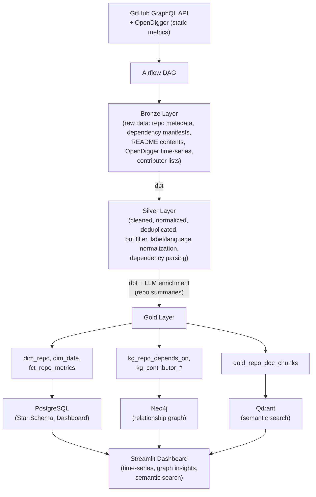

# HybridRAG-Forge 🚧 under active development


[](https://github.com/ptrick13/HybridRAG-Forge/actions/workflows/ci.yml)
[](https://codecov.io/gh/ptrick13/HybridRAG-Forge)

An end-to-end data platform for Ecosystem Activity & Relationship Intelligence in the AI/Data tooling ecosystem.

## Project Goal & Core Use Case

HybridRAG-Forge ingests, transforms, and stores data for a curated set of GitHub repositories from the AI/Data tooling space. The central use case is **Ecosystem Activity & Relationship Intelligence**:

- **How do these tools evolve over time?** → PostgreSQL time-series via OpenDigger (stars, forks, issues, PRs, contributor count)
- **How are they related?** → Neo4j graph: dependency relationships (`repo A depends on repo B`) and contributor overlap between projects
- **How do I search their documentation semantically?** → Qdrant: chunked READMEs, semantically searchable via an embedding model

The platform follows the Medallion Architecture pattern (Bronze/Silver/Gold) via Apache Airflow and dbt.

---

## Architecture



---

## Tech Stack

| Component | Technology |
|---|---|
| Language | Python 3.11 |
| Orchestration | Apache Airflow |
| Transformation | dbt-core (Postgres adapter) |
| Analytical DB | PostgreSQL (Star Schema) |
| Graph DB | Neo4j |
| Vector DB | Qdrant |
| Dashboard | Streamlit |
| Infrastructure | Docker Compose |
| LLM/Embeddings | OpenAI-compatible API (configurable, default: low-cost model) |

---

## How This Repo Relates to NLPen and HybridRAG

**NLPen** provides the NLP foundations and knowledge extraction techniques that demonstrate how to derive structured information from unstructured text. **HybridRAG-Forge** is the data platform that operationalizes this knowledge: it populates the knowledge store (PostgreSQL, Neo4j, Qdrant) with curated, transformed data from the GitHub ecosystem. **HybridRAG** then builds on top of this knowledge store, implementing multi-agent retrieval strategies that combine semantic search (Qdrant), graph traversal (Neo4j), and SQL queries (PostgreSQL).

---

## Target Repositories

| Category | Repos |
|---|---|
| **LLM Agent Frameworks** | langchain-ai/langchain, langchain-ai/langgraph, run-llama/llama_index, deepset-ai/haystack, microsoft/autogen, crewAIInc/crewAI |
| **Vector Databases** | qdrant/qdrant, weaviate/weaviate, milvus-io/milvus, chroma-core/chroma |
| **Orchestration & Transformation** | apache/airflow, dbt-labs/dbt-core, dagster-io/dagster, PrefectHQ/prefect |
| **Embeddings & Models** | UKPLab/sentence-transformers, huggingface/transformers |
| **Inference & Serving** | vllm-project/vllm, ollama/ollama |
| **Evaluation & Observability** | explodinggradients/ragas, langfuse/langfuse |
| **Graph & Utilities** | networkx/networkx, neo4j/neo4j-python-driver, pydantic/pydantic, openai/tiktoken |

Full configuration lives in [extractors/config/target_repos.yaml](extractors/config/target_repos.yaml).

---

## Setup

```bash
# 1. Clone the repository
git clone https://github.com/ptrick13/HybridRAG-Forge.git
cd HybridRAG-Forge

# 2. Configure environment variables
cp .env.example .env
# Fill .env with your own values (GitHub token, DB credentials, etc.)

# 3. Start services (Postgres, Neo4j, Qdrant, Streamlit)
docker-compose up -d

# 4. Set up Python environment
python3.11 -m venv .venv
source .venv/bin/activate
pip install -r requirements.txt
```

All common commands are available via `make`:

```bash
make up           # Start Docker services
make down         # Stop Docker services
make lint         # Run Ruff linter (ruff check .) and format check (ruff format --check .)
make typecheck    # Run mypy type checker
make test         # Run pytest
make dbt-run      # Run dbt models
make dbt-test     # Run dbt tests
```

---

## Testing

Unit tests require no external services and run in seconds.
Integration tests (`tests/integration/`) require Docker — testcontainers spins up a temporary PostgreSQL container automatically.

### Lint
```bash
ruff check .
ruff format --check .
```

### Type check
```bash
mypy extractors/ loaders/postgres/ --ignore-missing-imports
```

### Tests
```bash
pytest -v
```

| Test file | What is tested |
|---|---|
| `tests/unit/test_github_graphql.py` | `build_request_payload()`, `_make_request()`, `fetch_repo()`, `save_repo()` — GraphQL query field validation, rate limit handling, JSON persistence |
| `tests/unit/test_opendigger.py` | `build_metric_url()`, `fetch_metric()`, `save_metric()` — URL construction, 404 handling, request errors, file naming |
| `tests/integration/test_bronze_load.py` | `load_github_repos()`, `load_opendigger_metrics()` — upsert correctness, idempotency, conflict resolution |

---

## Roadmap

| Phase | Content | Status |
|---|---|---|
| **1 – Scaffold** | Repo structure, Docker Compose, dbt skeleton, CI | ✅ done |
| **2 – Bronze extractors** | GitHub GraphQL API + OpenDigger fetcher, raw data into Postgres Bronze | ✅ done |
| **3 – Silver/dbt** | dbt models: cleaning, normalization, dependency parsing, bot filter | 🔜 |
| **4 – AI enrichment** | LLM-based repo summaries (one-time run), embedding generation | 🔜 |
| **5 – Gold/Star Schema + KG** | dbt Gold models: Star Schema (Postgres), KG export (Neo4j), doc chunks (Qdrant) | 🔜 |
| **6 – Loaders** | Postgres, Neo4j, and Qdrant loaders | 🔜 |
| **7 – Airflow orchestration** | DAG for daily ingestion, dependency graph | 🔜 |
| **8 – Dashboard** | Streamlit: time-series charts, graph insights, semantic search | 🔜 |
